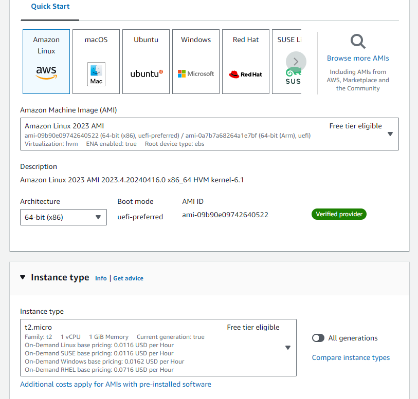
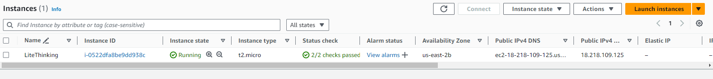
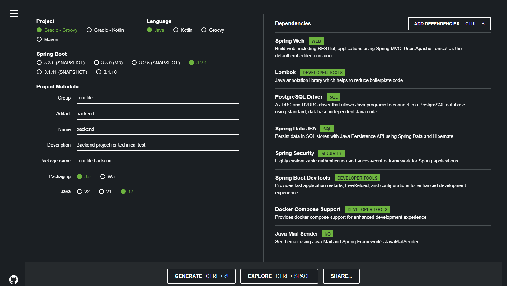
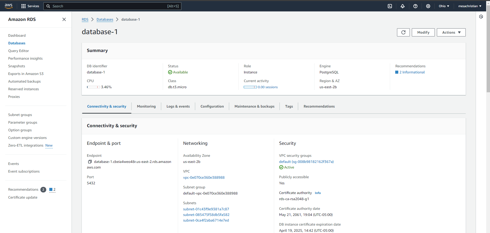
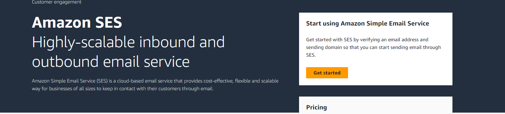

# Prueba tecnica readme

En este readme se explicaran los pasos para crear la solucion a la prueba tecnica de Lite Thinking.

# USUARIOS DE TEST Y DIRECCION DE DESPLIEGUE DE LA APP
link : http://ec2-3-19-70-108.us-east-2.compute.amazonaws.com/

Usuario administrador:
- email: admin@lite.com
- password: admin123

Usuario externo:
- email: user@lite.com
- password: user123

## Frontend

Para desarrollar el frontend se escoge react como framework de desarrollo typescript como lenguaje de programacion

Para la creacion de la aplicacion usanmos vite por sus ventajas en velocidad y peso. Para esto se usa el siguiente comando:

```
npm create vite@latest frontend -- --template react-ts
```

Para tener unos componentes predefinidos en el frontend se usara la libreria de material-ui la cual nos permite acceder a un set de componentes.

Su despliege se hace en una maquina ec2 desplegando un contenedor de docker con las dependencias del proyecto:





Para esto copiamos los archivos a la maquina usando una llave previamente creda para la comunicacion por ssh.

```
scp -i .\lite-kp.pem -r .\frontend\ ec2-user@3.139.58.120:/home/ec2-user/lite
```

Una vez estan subidos los archivos corremos los siguientes comandos: 
```
sudo docker build . -t "litefront:v1.0"
sudo docker run -d -p 80:9000 litefront:v1.0
```

## Backend

En https://start.spring.io/ creamos el siguiente proyecto con las siguientes dependencias las cuales nos bastan para crear la solucion.



## Base de datos

Para la base de datos se usa postgresql. Usamos RDS de amazon que nos permite instanciar facilmente:



Este servicio nos permite una comunicacion rapida con Elastic Beanstalk donde se encuentra nuestro .jar desplegado

## Envio De correos
Para poder enviar aws ofrece un service smtp conocido como ses



